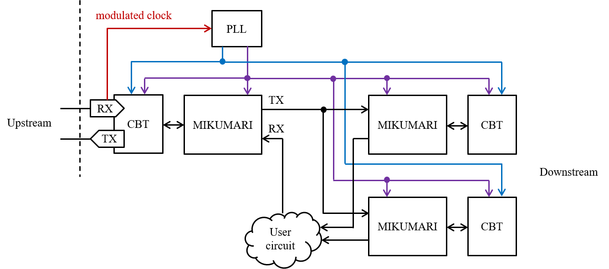

# MIKUMARI

The MIKUMARI system is a clock, timing, and synchronous command distribution system for front-end electronics (FEE) based on the [clock-duty-cycle-modulation (CDCM)](https://ieeexplore.ieee.org/document/9131833). By distributing a modulated clock based on pulse width modulation (PWM), it is possible to transmit both clock and data on a single transmission line while achieving clock recovery independent of the clock-data-recovery (CDR) circuit. MIKUMARI consists of the CDCM based transceiver (CBT) and the link layer protocol, the MIKUMARI link. The CBT provides the functionalities of the physical layer, and the MIKUMARI link defines the communication protocol between physically connected link end points.

The MIKUMARI system is manufacture IP independent except for the serializer/de-serializer block in the CBT. Currently, the CBT is implemented for Xilinx 7-series FPGAs using the IOSERDES primitive.

## Overview

The minimum configuration of the MIKUMARI system is shown in the [figure](#MIKUMARI-MIN-CONFIG). The left and right hand sides are the master and the slave, respectively. The purpose of the MIKUMARI system is distributing the reference clock to all the FEEs, and then a master module must have an oscillator. To operate the system, two skew adjusted clock signals are necessary. One is the parallel clock signal to drive the parallel data path, and the other is the serial clock signal to drive the transmission line. In many cases, the reference clock will be equal to the parallel clock. The frequency ratio between the serial and parallel clock signals is defined by the modulation pattern. If the CDCM-10-XX (See [Ref](https://ieeexplore.ieee.org/document/9131833).) is used, the developer has to prepare the 5 times faster serial clock than that of the parallel clock. The maximum transferable reference (parallel) clock frequency is determined by the maximum acceptable clock frequency of the clock buffer in FPGA or the maximum data rate of IO pads. For example for Kintex-7 with the speed-grate -1 and the FBG package, the maximum BUFG speed and the maximum IO rate are 625 MHz and 1250 Mbps (HP bank case), and then the maximum transferable parallel clock speed is 125 MHz.

In the slave side, these clock signals are reproduced from the modulated clock signal by a PLL on FEEs. Many PLL devices, i.e., PLLs in FPGA, external PLL ICs, and external jitter cleaner ICs, will work as a clock recovery circuit. To obtain the good jitter performance, the PLL of which the phase noise in low frequency region is low should be selected. The jitter distribution depends on the selected PLL device. As discussed in [Ref](hogehoge), the obtained jitter rms when using MMCM in Kintex-7 FPGA is worse than that of the external jitter cleaner IC, CDCE62002. This comes not from the main peak structure but from the tail structure mainly. In author's opinion, MMCM is enough for 1 ns TDC synchronization, but it is not enough for high-resolution TDC with the precision around 30 ps. From the view point of the clock phase uncertainty, the PLL should have a zero-delay mode. As the CDCM technique recovers the parallel clock from the modulated clock, the phase uncertainty of the recovered clock does not appear if the PLL has the zero-delay mode. This is the important difference between the CDR circuit, which reproduced the serial clock. Unavoidable phase uncertainty exists due to the frequency division.

{: #MIKUMARI-MIN-CONFIG width="95%"}

Since the MIKUMARI system aims to distribute the reference clock to synchronize FEEs, the connection topology of the MIKUMARI link should be a tree structure starting from a master module. If the master module cannot drive all FEEs, a fan-out module is necessary in intermediate layers. An example of fan-out is shown in the [figure](#MIKUMARI-FANOUT). As the CBT and the MIKUMARI link are defined as the full-duplex transceiver and the link protocol for point-to-point communication, respectively, a simple signal fan-out is not allowed. In fan-out module, the clock signals are once recovered and drive the CBTs transferring the modulated clock signal to downstream modules. In many applications, all FEEs will receive the same command from the master module, and then TX data can be broadcasted, however, a user circuit summarizing information from the downstream modules will be necessary in the RX side. However, this is not mandatory. Since the TX and RX of the MIKUMARI link are independent, the RX port of the right side can be left open if you decide not to use the uplink data path.

{: #MIKUMARI-FANOUT width="90%"}

The MIKUMARI link does not have a routing function, and then it does not support the end-to-end (source to destination) communication. Therefore, the clock, timing, and synchronous data transmissions are realized by repeating the point-to-point communication in the link layer. Thus, arbitrariness exists in the connection scheme inside the fan-out module. The MIKUMARI link protocol does not include experimental specific functions. It just provides the functionalities for sending a one-shot pulse with the fixed latency and the normal data transmission using the frame structure. An upper layer protocol, which gives dedicated functions for each experiment, is additionally necessary when using this system in actual experiments.


## CDCM based transceiver (CBT)

The CBT is a physical layer of the MIKUMARI system. About the CBT, see also [Ref](hogehoge). The roles of the CBT are as follows.

- Encode and decode the CDCM modulated waveform pattern
- Defines three types of CBT character using sign extension from 8-bit to 10-bit
- Initialize IOSERDES when detecting the cable (fiber) connection
- Provides the clock monitor and the error detection.

Currently, the CBT supports the CDCM-10-2.5 and CDCM-10-1.5. Then, the frequency ratio between the serial and parallel clock signals is 5 with the double-data-rate (DDR) mode. The SDR mode is not supported. In addition, only the differential signal is supported.

### Interface of CBT

The top-level block of the CBT is **CbtLane**. The global parameters for the CBT are defined in ``defCDCM.vhd``. The CbtLane's entity port structure is as follows.

```VHDL
entity CbtLane is
  generic
    (
      -- CDCM-TX --
      kIoStandardTx    : string;  -- IO standard of OBUFDS
      kTxPolarity      : boolean:= FALSE; -- true: inverse polarity
      -- CDCM-RX --
      genIDELAYCTRL    : boolean; -- If TRUE, IDELAYCTRL is instantiated.
      kDiffTerm        : boolean; -- IBUF DIFF_TERM
      kRxPolarity      : boolean; -- If true, inverts Rx polarity
      kIoStandardRx    : string;  -- IOSTANDARD of IBUFDS
      kIoDelayGroup    : string;  -- IODELAY_GROUP for IDELAYCTRL and IDELAY
      kFreqFastClk     : real;    -- Frequency of SERDES fast clock (MHz).
      kFreqRefClk      : real;    -- Frequency of refclk for IDELAYCTRL (MHz).
      -- Encoder/Decoder
      kNumEncodeBits   : integer:= 2;  -- 1:CDCM-10-1.5 or 2:CDCM-10-2.5
      -- Master/Slave
      kCbtMode         : string;  -- Master/Slave
      -- DEBUG --
      enDebug          : boolean:= false
    );
  port
    (
      -- SYSTEM port --
      srst          : in std_logic; -- Asyncrhonous assert, syncrhonous deassert reset. (active high)
      clkSer        : in std_logic; -- From BUFG (5 x clkPar freq.)
      clkPar        : in std_logic; -- From BUFG
      clkIndep      : in std_logic; -- Independent clock for monitor
      clkIdelayRef  : in std_logic; -- REFCLK input for IDELAYCTRL. Must be independent from clkPar.
      clkIsReady    : in std_logic; -- Indicate that clkSer and clkPar are available.
      initIn        : in std_logic; -- Re-do the initialization process. Sync with clkPar.

      -- Status --
      cbtLaneUp     : out std_logic;

      -- Error --
      patternErr    : out std_logic; -- Indicates CDCM waveform pattern is collapsed.
      --idelayErr     : out std_logic; -- Attempted bitslip but the expected pattern was not found.
      bitslipErr    : out std_logic; -- Bit pattern which does not match the CDCM rule is detected.
      watchDogErr   : out std_logic; -- Watch dog can't eat dogfood within specified time. The other side seems to be down.

      -- Data I/F --
      isKTypeTx     : in std_logic; -- 1: Generate a K type character. 0: D type character.
      dataInTx      : in CbtUDataType;
      validInTx     : in std_logic; -- 1: charIn is valid. Encode and send it to CDCM-TX.
                                    -- 0: Send idle pattern;
      txBeat        : out std_logic; -- Indicates encoder cycle.
      txAck         : out std_logic; -- Acknowledge to validInTx.

      isIdleRx      : out std_logic; -- Indicates present character is idle.
      isKTypeRx     : out std_logic; -- 1: K type character. 0: D type character.
      dataOutRx     : out CbtUDataType;
      validOutRx    : out std_logic; -- 1: charOut is valid.

      -- CDCM ports --
      cdcmTxp       : out std_logic; -- Connect to TOPLEVEL port
      cdcmTxn       : out std_logic; -- Connect to TOPLEVEL port
      cdcmRxp       : in std_logic;  -- Connect to TOPLEVEL port
      cdcmRxn       : in std_logic;  -- Connect to TOPLEVEL port
      modClock      : out std_logic  -- CDCM modulated clock.

    );
end CbtLane;
```

<table class="vmgr-table">
  <thead><tr>
    <th class="nowrap"><span class="mgr-10">Port </span></th>
    <th class="nowrap"><span class="mgr-10">In/Out</span></th>
    <th class="nowrap"><span class="mgr-10">Comment</span></th>
  </tr></thead>
  <tbody>
  <tr><td class="tcenter" colspan=4><b>Generic port</b></td></tr>
  <tr>
    <td>kIoStandardTx</td>
    <td class="tcenter">-</td>
    <td>Tx port IO standard, e.g., LVDS.</td>
  </tr>
  <tr>
    <td>kTxPolarity</td>
    <td class="tcenter">-</td>
    <td>If it's true, the TX signal polarity is reversed. Use it when the differential signal p/n connection is inverse on FEE.</td>
  </tr>
  <tr>
    <td>genIDELAYCTRL</td>
    <td class="tcenter">-</td>
    <td>If it's true, the IDELAYCTRL primitive is instantiated in the CBT.</td>
  </tr>
  <tr>
    <td>kDiffTerm</td>
    <td class="tcenter">-</td>
    <td>Enable the internal 100-ohm termination register in FPGA.</td>
  </tr>
  <tr>
    <td>kRxPolarity</td>
    <td class="tcenter">-</td>
    <td>If it's true, the RX signal polarity is reversed. Use it when the differential signal p/n connection is inverse on FEE.</td>
  </tr>
  <tr>
    <td>kIoDelayGroup</td>
    <td class="tcenter">-</td>
    <td>Set the IODELAY_GROUP constraint to the IDELAYCTRL and IDELAYE2 primitives in the CBT.</td>
  </tr>
  <tr>
    <td>kFreqFastClk</td>
    <td class="tcenter">-</td>
    <td>The frequency value of the serial clock. It is used to determine the tap number for adjusting IDELAYE2</td>
  </tr>
  <tr>
    <td>kFreqRefClk</td>
    <td class="tcenter">-</td>
    <td>The frequency value for IDELAYCTRL. It is used to determine the tap number for adjusting IDELAYE2</td>
  </tr>
  <tr>
    <td>kNumEncodeBits</td>
    <td class="tcenter">-</td>
    <td>Set the payload size of the CDCM signal. Set 1 or 2. 1: CDCM-10-1.5. 2: CDCM-10-2.5.</td>
  </tr>
    <td>kCbtMode</td>
    <td class="tcenter">-</td>
    <td>Set Master or Slave. The CBT runs with the designated mode.</td>
  </tr>
  </tr>
    <td>enDebug</td>
    <td class="tcenter">-</td>
    <td>Enable preset mark_debug constraints. The debug core will be implemented.</td>
  </tr>
  <tr><td class="tcenter" colspan=4><b>IO port</b></td></tr>
  <tr>
    <td>srst</td>
    <td class="tcenter">In</td>
    <td>Asynchronous assert, synchronous de-assert reset. (active high) </td>
  </tr>
  <tr>
    <td>clkSer</td>
    <td class="tcenter">In</td>
    <td>Serial clock input. The clock skew must be adjusted between clkSer and clkPar.</td>
  </tr>
  <tr>
    <td>clkPar</td>
    <td class="tcenter">In</td>
    <td>Parallel clock input. The clock skew must be adjusted between clkSer and clkPar. Status, error, and Data I/F ports are synchronized with this clock.</td>
  </tr>
  <tr>
    <td>clkIndep</td>
    <td class="tcenter">In</td>
    <td>The independent clock from the clkPar. Its clock frequency should be clkPar < clkIndep < 2*clkPar. If the frequency is exactly twice of clkPar, you could get a trouble.</td>
  </tr>
  <tr>
    <td>clkIdelayRef</td>
    <td class="tcenter">In</td>
    <td>REFCLK input for IDELAYCTRL. It must be independent from clkPar.</td>
  </tr>
  <tr>
    <td>clkIsReady</td>
    <td class="tcenter">In</td>
    <td>It indicates that clkPar and clkSer are available. If this signal is low, the CBT does not start the initialization process. Set it high when the PLL output signals are well stabilized. Probably, the PLL clock signal synchronized with clkPar can be used, but the delayed one is generally preferred.</td>
  </tr>
  <tr>
    <td>initIn</td>
    <td class="tcenter">In</td>
    <td>If it is high, the CBT re-do the initialization process. This signal must be synchronized with clkPar.</td>
  </tr>
  <tr>
    <td>cbtLaneUp</td>
    <td class="tcenter">Out</td>
    <td>This goes high when the CBT becomes ready for communication after finishing the initialization process. </td>
  </tr>
  <tr>
    <td>patternErr</td>
    <td class="tcenter">Out</td>
    <td>This goes high when the waveform, which is not matched with the CDCM modulation pattern, is detected. Data is broken. </td>
  </tr>
  <tr>
    <td>bitslipErr</td>
    <td class="tcenter">Out</td>
    <td>This goes high when the reference bit pattern cannot be detected during the initialization process. Re-initialization is necessary.</td>
  </tr>
  <tr>
    <td>watchDotErr</td>
    <td class="tcenter">Out</td>
    <td>This goes high when the watch dog timer can't eat dogfood within specified time. The other side link seems to be down.</td>
  </tr>
  <tr>
    <td>isKTypeTx</td>
    <td class="tcenter">In</td>
    <td>If this is high, the current TX data is translated to a K-type character. If low, the TX data becomes a D-type character.</td>
  </tr>
  <tr>
    <td>dataInTx</td>
    <td class="tcenter">In</td>
    <td>8-bit TX data.</td>
  </tr>
  <tr>
    <td>validInTx</td>
    <td class="tcenter">In</td>
    <td>It denotes that the current dataInTx is valid. It is the request for the CBT to transmit it.</td>
  </tr>
  <tr>
    <td>txBeat</td>
    <td class="tcenter">Out</td>
    <td>This signal goes high once per a CBT character transfer cycle for one clock cycle. It indicates a boundary of the transfer cycle.</td>
  </tr>
  <tr>
    <td>txAck</td>
    <td class="tcenter">Out</td>
    <td>The acknowledge signal respect to validInTx. This goes high when the dataInTx is latched at the same timing of the txBeat.</td>
  </tr>
  <tr>
    <td>isIdleRx</td>
    <td class="tcenter">Out</td>
    <td>This goes high when the current dataOutRx is a idle data.</td>
  </tr>
  <tr>
    <td>isKTypeRx</td>
    <td class="tcenter">Out</td>
    <td>This goes high when the current dataOutRx is a K-Type data.</td>
  </tr>
  <tr>
    <td>dataOutRx</td>
    <td class="tcenter">Out</td>
    <td>8-bit RX data.</td>
  </tr>
  <tr>
    <td>validOutRx</td>
    <td class="tcenter">Out</td>
    <td>This goes high when the current dataOutRX valid both for D- and K-types data.</td>
  </tr>
  <tr>
    <td>cdcmTxp</td>
    <td class="tcenter">Out</td>
    <td>Transmission line positive. Connect to the toplevel port.</td>
  </tr>
  <tr>
    <td>cdcmTxn</td>
    <td class="tcenter">Out</td>
    <td>Transmission line negative. Connect to the toplevel port.</td>
  </tr>
  <tr>
    <td>cdcmRxp</td>
    <td class="tcenter">In</td>
    <td>Receive line positive. Connect to the toplevel port.</td>
  </tr>
  <tr>
    <td>cdcmRxn</td>
    <td class="tcenter">In</td>
    <td>Receive line negative. Connect to the toplevel port.</td>
  </tr>
  <tr>
    <td>modClock</td>
    <td class="tcenter">Out</td>
    <td>The CDCM modulated clock output. It is valid in the slave mode.</td>
  </tr>
</tbody>
</table>

### CBT characters

The CBT character is a 10-bit internal data format in the CBT and is generated by simply adding 2-bit type header to a 8-bit data. There are K-, D-, and T-types characters. In addition, there is a IDLE character, which consists of the modulated signal with the duty ration of 50%. The T-type characters are used to control the CBT, and they are hidden inside the CBT. K-type characters are used to control the link protocol, and their bit pattern are defined in the CBT level. D-type characters are user data. The transmission request for D- and K-type characters are exclusive because it is determined by isKTypeTx signal. However, T-type character transmission can conflict with D- and K-type characters. The transmission priority among characters is defined as **D < T < K** characters. During the T-type character transmission, D-type character transmission is held up. The link protocol needs to keep the current dataInTx until the txAck is returned.

### CDCM encode and decode

Currently, the CBT supports CDCM-10-1.5 and CDCM-10-2.5; they can transmit 1-bit binary + idle pattern and 2-bit binary + idle pattern per clkPar cycle, respectively. For details, see [Ref](https://ieeexplore.ieee.org/document/9131833) and [Ref](hogehoge). Since the CBT character has 10-bit data width, 10 and 5 clock cycles are necessary to send a CBT character by CDCM-10-1.5 and CDCM-10-2.5, respectively. CDCM-10-1.5 has longer latency while it provides the better jitter performance because the duty cycle change range is narrower than that of CDCM-10-2.5.

### Initialization process

The CBT starts the initialization process when the following conditions are met.

- srst and initIn are low.
- clkIsReady is high.
- The clock monitor detects a clock like signal in the RX signal.

The IDELAYE2 tap number is adjusted so as to stabilize the sampled data using the idle pattern, and bitslip is performed so as to reproduce the bit pattern of ``0b11111_00000``. After initializing IOSERDES, some T-type characters are exchanged to confirm that both end points are actually ready for communication each other. Then, the cbtLaneUp is asserted.

### Error detection

The clock monitor is always checking whether the RX signal is clock link or not. If this monitor misses the clock link RX signal, it requests to reset the CBT. If cbtLaneUp is high, it will be immediately de-asserted.

When cbtLaneUp is high, the CBT checks whether the sampled bit pattern is matched with the CDCM encoding rule or not. If a broken pattern is detected, the patternErr signal is asserted, but at this moment, the CBT is not reset. If **more than 1%** of received bit pattern are broken, the RX quality check monitor requests to reset the CBT.

When cbtLaneUp is high, the CBT transmits the T-type character, dogfood character, periodically. The dogfood character resets the watch dog timer in other side. If the watch dog timer can't eat dogfood within specified time, the watchDogErr goes high, and the watchdog timer requests to reset the CBT.
