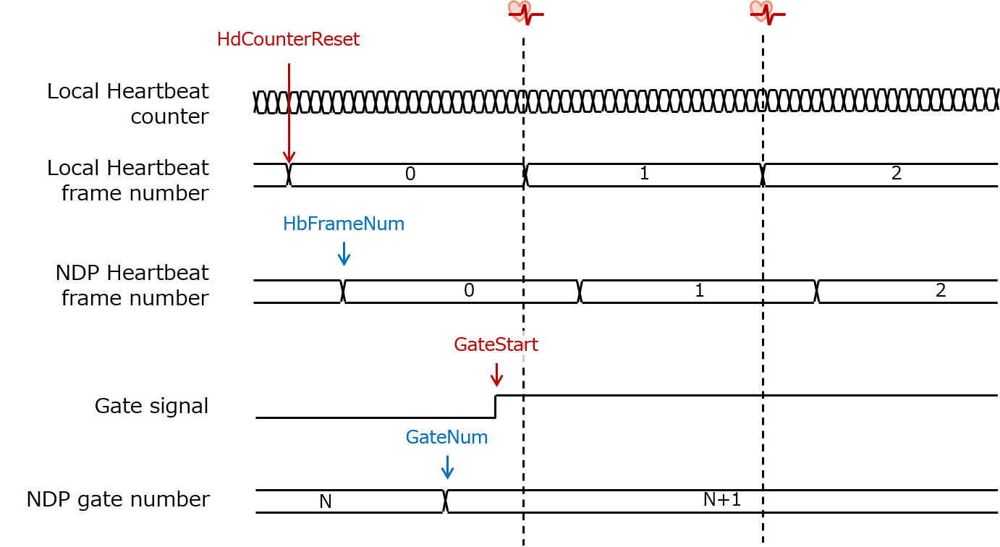

# NestDAQ protocol

NestDAQ protocol is an upper layer protocol to distribute the timing pulses and the command to the front-end electronics and to gather status information from FEEs. This protocol is designed for applications in the J-PARC hadron experiments where the DC beams is delivered by the slow extraction method. In addition, it is also expected that the [NestDAQ](https://github.com/spadi-alliance/nestdaq) framework is used for the data acquisition software.

As the NestDAQ protocol is still dedicated to the point-to-point data communication, the routing function  is not supported. The [figure](#NDP-OV) represents the overview of the NestDAQ protocol. The data structure is asymmetric between downward and upward data path. In the downward data path, the 8-bit commands are sent together with 32-bit register values from the master side as the payload of the MIKUMARI frame. In addition, the pulse transmission is supported. In the upward direction, 8-bit status flags are sent back from the slave side. This is also realized by the MIKUMARI frame. As explained in the MIKUMARI section, there is the CBT character transfer cycle and the transmission priority among character types behind the command transmission, and then there is a range of latency from when the transfer request is issued until the data arrives. Thus, the commands are used for the semi-synchronous operation. The status flag update has also a range of latency.

{: #NDP-OV width="90%"}

## Pulse and Command definition

### Pulse definition

Currently, 6 types of pulses are defined in the NestDAQ protocol.

<table class="vmgr-table">
  <thead><tr>
    <th class="nowrap"><span class="mgr-30">Pulse Type</span></th>
    <th class="nowrap"><span class="mgr-10">Index</span></th>
    <th class="nowrap"><span class="mgr-10">Comment</span></th>
  </tr></thead>
  <tbody>
  <tr>
    <td class="tcenter">HardReset</td>
    <td class="tcenter">0</td>
    <td>Transfer the hardware reset pulse. The author expect that this signal is for emergency use. The front-end module should be reset by the reset signal generated by the local bus controller through the data link (SiTCP). It is not expected use this signal in the normal operation. Users may assert this signal when the data link is hang up.</td>
  </tr>
  <tr>
    <td class="tcenter">HbCounterReset</td>
    <td class="tcenter">1</td>
    <td>Heartbeat counter reset. Use this signal to set the local heartbeat counter value 0. It works to synchronize the heartbeat frame. The author expects that the local heartbeat frame number should also be set to 0 by this signal.</td>
  </tr>
  <tr>
    <td class="tcenter">GateStart</td>
    <td class="tcenter">2</td>
    <td>It provides the data acquisition gate ON timing. During gate ON, the data are streaming in the TDC and go to the PC through the data link.</td>
  </tr>
  <tr>
    <td class="tcenter">GateEnd</td>
    <td class="tcenter">3</td>
    <td>It provides the data acquisition gate OFF timing. By de-asserting the gate signal, the data flow in the TDC is stopped.</td>
  </tr>
  <tr>
    <td class="tcenter">VetoStart</td>
    <td class="tcenter">4</td>
    <td>It provides the VETO start timing. If the VETO signal is ON, the data flow in the TDC is stopped even if the gate is ON. This signal is used to stop the TDC data generation without turing off the data acquisition gate.</td>
  </tr>
  <tr>
    <td class="tcenter">VetoEnd</td>
    <td class="tcenter">5</td>
    <td>It provides the VETO end timing.</td>
  </tr>
</tbody>
</table>

### Command definition

Currently, 4 type commands are defined.

<table class="vmgr-table">
  <thead><tr>
    <th class="nowrap"><span class="mgr-30">Command</span></th>
    <th class="nowrap"><span class="mgr-10">Index</span></th>
    <th class="nowrap"><span class="mgr-10">Comment</span></th>
  </tr></thead>
  <tbody>
  <tr>
    <td class="tcenter">RunStart</td>
    <td class="tcenter">0</td>
    <td>Change the run status from IDLE to RUN.</td>
  </tr>
  <tr>
    <td class="tcenter">RunEnd</td>
    <td class="tcenter">1</td>
    <td>Change the run status from RUN to IDLE.</td>
  </tr>
  <tr>
    <td class="tcenter">HbFrameNum</td>
    <td class="tcenter">2</td>
    <td>Global heartbeat frame number update. If the command is HbFrameNum, it indicates that the following register value is the global heartbeat frame number.</td>
  </tr>
  <tr>
    <td class="tcenter">GateNum</td>
    <td class="tcenter">3</td>
    <td>Gate number update. If the command is GateNum, it indicates that the following register value is the the gate number.</td>
  </tr>
</tbody>
</table>

### Register definition

The command transmission in the downward direction, the command accompanies the 32-bit register value. What the received register indicates is determined by checking the received command. Currently, two types of register values exists.

<table class="vmgr-table">
  <thead><tr>
    <th class="nowrap"><span class="mgr-30">Register</span></th>
    <th class="nowrap"><span class="mgr-10">Width</span></th>
    <th class="nowrap"><span class="mgr-10">Comment</span></th>
  </tr></thead>
  <tbody>
  <tr>
    <td class="tcenter">Heartbeat frame number</td>
    <td class="tcenter">16</td>
    <td>Global heartbeat frame number.</td>
  </tr>
  <tr>
    <td class="tcenter">Gate number</td>
    <td class="tcenter">8</td>
    <td>Global gate number</td>
  </tr>
</tbody>
</table>

### Status flag definition

In the upward direction, 8-bit status flags are returned from FEEs. Current definition of the 8-bit flag is as follows.

<table class="vmgr-table">
  <thead><tr>
    <th class="nowrap"><span class="mgr-30">Flag</span></th>
    <th class="nowrap"><span class="mgr-10">Index</span></th>
    <th class="nowrap"><span class="mgr-10">Comment</span></th>
  </tr></thead>
  <tbody>
  <tr>
    <td class="tcenter">ModBusy</td>
    <td class="tcenter">0</td>
    <td>Set to high when the streaming TDC is under the busy mode.</td>
  </tr>
  <tr>
    <td class="tcenter">ModReady</td>
    <td class="tcenter">1</td>
    <td>Set to high when the module is ready to start data acquisition.</td>
  </tr>
  <tr>
    <td class="tcenter">DLkinStatus</td>
    <td class="tcenter">2</td>
    <td>Set to high when the TCP connection is established.</td>
  </tr>
  <tr>
    <td class="tcenter">SEUStatus</td>
    <td class="tcenter">3</td>
    <td>Set to high when the unrecoverable SEU error is detected.</td>
  </tr>
  <tr>
    <td class="tcenter">TimeFrameSlip</td>
    <td class="tcenter">4</td>
    <td>Set to high if the local and global heartbeat frame numbers are miss matched at the timing of the delimiter word insertion timing.</td>
  </tr>
  <tr>
    <td class="tcenter">NotInUse1</td>
    <td class="tcenter">5</td>
    <td>Not in use</td>
  </tr>
  <tr>
    <td class="tcenter">NotInUse2</td>
    <td class="tcenter">6</td>
    <td>Not in use</td>
  </tr>
  <tr>
    <td class="tcenter">NotInUse3</td>
    <td class="tcenter">7</td>
    <td>Not in use</td>
  </tr>
</tbody>
</table>

## Relation between streaming TDC an NestDAQ protocol

The NestDAQ protocol (NDP) has a role to control the streaming TDC on the FEE. Here, the author describes the relation between behavior of the streaming TDC and the NDP. The data acquisition condition for the streaming TDC is defined as shown in the [figure](#GATE-TC). The acquisition condition is defined by the run status, the gate signal, and the veto signal. The streaming can work and generate the TDC data when the run status is *RUN*, the gate signal is high, and the veto signal is low. The NDP master module set the run status to *RUN*, if the DAQ run start is requested by the PC and all FEEs return ModReady high. The streaming TDC does not work under the *IDLE* status even if the gate signal is low. After setting the run status *RUN*, the master module sends the GateStart pulse to open the gate. Thus, the streaming TDC starts working. The data generation can be temporally stopped by the veto signal.

{: #GATE-TC width="90%"}

The time chart for the heartbeat related things is represented in the figure. The HbCounterReset pulse resets the local heartbeat counter and the local heartbeat frame number. The local heartbeat frame number is internally incremented at the heartbeat timing in each FEE. The global (NDP) frame number is updated after the heartbeat. These two number must be the same and at the heartbeat timing. The streaming TDC checks the sameness of two frame numbers, and if they are different, the FEE sets the TimeFrameSlip flag ON and sets  the slip flag in the delimiter word of the streaming TDC.

The author expects that this signal is sent before opening the gate. As the gate number is inserted into the delimiter word, the gate number should be updated before sending the GateStart pulse.

{: #HB-TC width="90%"}

## Application in J-PARC hadron experiments

The author expects that the P3 signal from the MR is used as the HbCounterReset pulse. The P3 signal represents the flat-top start timing and is the important reference timing determined by the accelerator in the slow extraction method.

The gate signal corresponds to the spill gate in the J-PARC hadron experiments. The extraction starts several hundred ms after the P3 signal. The opening timing of the spill gate is user defined. It defines when the data acquisition starts during the slow extraction. The author expects that the GateStart pulse is generated as the delayed pulse of the P3 signal. The closing timing of the spill gate is also user defined.

## NdpMaster

The NdpMaster is the command and pulse sender in the MIKUMARI system. It is implemented in the master module, and if there is a distributer module, it is instantiated as the command and pulse sender to each FEE. The entity port structure is as follows.

```VHDL
entity NdpMaster is
  port
  (
    -- system --
    rst             : in std_logic;
    clkPar          : in std_logic;
    linkUpIn        : in std_logic;

    busyPulseSend   : out std_logic;
    busyCommandSend : out std_logic;

    -- Pulse input --
    ndpPulseIn      : in NdpPulseType;
    pulseError      : out std_logic;

    -- Command input --
    ndpCommandIn    : in NdpCommandType;
    commandError    : out std_logic;

    hbNumber        : in HbNumberType;
    gateNumber      : in GateNumberType;

    -- Slave flag output --
    ndpFlagOut      : out NdpFlagType;


    -- MIKUMARI IF --
    dataOutTx       : out CbtUDataType;
    validOutTx      : out std_logic;
    frameLastOutTx  : out std_logic;
    txAck           : in std_logic;

    pulseOut        : out std_logic;
    pulseTypeOut    : out MikumariPulseType;
    busyPulseTx     : in std_logic;

    dataInRx        : in CbtUDataType;
    validInRx       : in std_logic;
    frameLastRx     : in std_logic

  );
end NdpMaster;
```
<table class="vmgr-table">
  <thead><tr>
    <th class="nowrap"><span class="mgr-10">Port </span></th>
    <th class="nowrap"><span class="mgr-10">In/Out</span></th>
    <th class="nowrap"><span class="mgr-10">Comment</span></th>
  </tr></thead>
  <tbody>
  <tr><td class="tcenter" colspan=4><b>IO port</b></td></tr>
  <tr>
    <td>rst</td>
    <td class="tcenter">In</td>
    <td>Asynchronous reset. (active high) </td>
  </tr>
  <tr>
    <td>clkPar</td>
    <td class="tcenter">In</td>
    <td>Parallel clock input.</td>
  </tr>
  <tr>
    <td>linkUpIn</td>
    <td class="tcenter">In</td>
    <td>Input linkUp signal from the MIKUMARI link.</td>
  </tr>
  <tr>
    <td>busyPulseSend</td>
    <td class="tcenter">Out</td>
    <td>The next pulse transmission request is ignored while this signal is high.</td>
  </tr>
  <tr>
    <td>busyCommandSend</td>
    <td class="tcenter">Out</td>
    <td>The next command transmission request is ignored while this signal is high.</td>
  </tr>
  <tr>
    <td>ndpPulseIn</td>
    <td class="tcenter">In</td>
    <td>Pulse transmission request. This is the std_logic_vector whose length is the number of pulse types. To send the pulse, set 1 to the bit corresponding to the target pulse type. Do not set more than 2-bits to 1. The MIKUMARI pulse transmission function can send only a pulse type at the same time. The request signal width must  be one-shot.</td>
  </tr>
  <tr>
    <td>pulseError</td>
    <td class="tcenter">Out</td>
    <td>This goes high if the user requests to send more than two types of pulses at the same time.</td>
  </tr>
  <tr>
    <td>ndpCommandIn</td>
    <td class="tcenter">In</td>
    <td>Command transmission request. This is the std_logic_vector whose length is the number of commands. To send the command, set 1 to the bit corresponding to the target command type. Do not set more than 2-bits to 1. The values on hbNumber and gateNumber ports are latched when any of the bits in ndpCommandIn is set to 1.</td>
  </tr>
  <tr>
    <td>commandError</td>
    <td class="tcenter">Out</td>
    <td>This goes high if the user requests to send more than two types of commands at the same time.</td>
  </tr>
  <tr>
    <td>hbNumber</td>
    <td class="tcenter">In</td>
    <td>16-bit heartbeat frame number input. It is latched when any of the bits of ndpCommandIn is set to 1.</td>
  </tr>
  <tr>
    <td>gateNumber</td>
    <td class="tcenter">In</td>
    <td>8-bit gate number input. It is latched when any of the bits of ndpCommandIn is set to 1.</td>
  </tr>
  <tr>
    <td>ndpFlagOut</td>
    <td class="tcenter">Out</td>
    <td>NDP flag output. This is the std_logic_vector whose length is the number of flags. The bits are flipped when the flag information is updated by the slave side.</td>
  </tr>
  <tr>
    <td>dataOutTx</td>
    <td class="tcenter">Out</td>
    <td>Connect to dataInTx in the MikumariLane.</td>
  </tr>
  <tr>
    <td>validOutTx</td>
    <td class="tcenter">Out</td>
    <td>Connect to validInTx in the MikumariLane.</td>
  </tr>
  <tr>
    <td>frameLastOutTx</td>
    <td class="tcenter">Out</td>
    <td>Connect to frameLastInTx in the MikumariLane.</td>
  </tr>
  <tr>
    <td>txAck</td>
    <td class="tcenter">In</td>
    <td>Connect to txAck in the MikumariLane.</td>
  </tr>
  <tr>
    <td>pulseOut</td>
    <td class="tcenter">Out</td>
    <td>Connect to pulseIn in the MikumariLane.</td>
  </tr>
  <tr>
    <td>pulseTypeOut</td>
    <td class="tcenter">Out</td>
    <td>Connect to pulseTypeIn in the MikumariLane.</td>
  </tr>
  <tr>
    <td>busyPulseTx</td>
    <td class="tcenter">In</td>
    <td>Connect to busyPulseTx in the MikumariLane.</td>
  </tr>
  <tr>
    <td>dataInRx</td>
    <td class="tcenter">In</td>
    <td>Connect to dataOutRx in the MikumariLane.</td>
  </tr>
  <tr>
    <td>validRxIn</td>
    <td class="tcenter">In</td>
    <td>Connect to validOutRx in the MikumariLane.</td>
  </tr>
  <tr>
    <td>frameLastRx</td>
    <td class="tcenter">In</td>
    <td>Connect to frameLastOutRx in the MikumariLane.</td>
  </tr>
</tbody>
</table>

The NdpMaster hides the txAck cycle of the MIKUMARI link. The pulse/command transmissions are managed by the busy signals trigger by the transmission request. The pulse and command transmissions are requested by setting 1 to the bit in ndpPulseIn and ndpCommandIn, respectively. For example, the HbCounterReset index is 1, and then the pulse transmission with the HbCounterReset is requested by setting the ndpPulseIn vector as `0b00_0010`, like `ndpPulseIn(kHbCounterReset) <= '1'`. **The request signal width must be one-shot.** If the request is accepted, the busy signal goes high. When the busy signal is high, the next request is ignored. This is the same for the command, but the values on hbNumber and gateNumber are latched at the command request timing.

ndpFlatOut is the flag vector indicating the status of the slave module. There is no valid signal for this status flags. If the slave module updates the flag, it goes to the master module and appears from this port.

## NdpSlave

The NdpSlave is the command and pulse receiver in the MIKUMARI system. It is implemented in the slave module, and if there is a distributer module, it is instantiated as the command and pulse receiver from the master module. The entity port structure is as follows.

```VHDL
entity NdpSlave is
  port
  (
    -- system --
    rst             : in std_logic;
    clkPar          : in std_logic;
    linkUpIn        : in std_logic;

    -- Pulse output --
    ndpPulseOut     : out NdpPulseType;
    pulseError      : out std_logic;

    -- Command output --
    ndpCommandOut   : out NdpCommandType;
    commandError    : out std_logic;

    hbNumber        : out HbNumberType;
    gateNumber      : out GateNumberType;

    -- Slave flag input --
    ndpFlagIn       : in NdpFlagType;

    -- MIKUMARI IF --
    dataOutTx       : out CbtUDataType;
    validOutTx      : out std_logic;
    frameLastOutTx  : out std_logic;
    txAck           : in std_logic;

    dataInRx        : in CbtUDataType;
    validInRx       : in std_logic;
    frameLastInRx   : in std_logic;
    checksumErr     : in std_logic;

    pulseIn         : in std_logic;         -- Reproduced one-shot pulse output.
    pulseTypeRx     : in MikumariPulseType  -- Short massange accompanying the pulse.

  );
end NdpSlave;
```

<table class="vmgr-table">
  <thead><tr>
    <th class="nowrap"><span class="mgr-10">Port </span></th>
    <th class="nowrap"><span class="mgr-10">In/Out</span></th>
    <th class="nowrap"><span class="mgr-10">Comment</span></th>
  </tr></thead>
  <tbody>
  <tr><td class="tcenter" colspan=4><b>IO port</b></td></tr>
  <tr>
    <td>rst</td>
    <td class="tcenter">In</td>
    <td>Asynchronous reset. (active high) </td>
  </tr>
  <tr>
    <td>clkPar</td>
    <td class="tcenter">In</td>
    <td>Parallel clock input.</td>
  </tr>
  <tr>
    <td>linkUpIn</td>
    <td class="tcenter">In</td>
    <td>Input linkUp signal from the MIKUMARI link.</td>
  </tr>
  <tr>
    <td>ndpPulseOut</td>
    <td class="tcenter">Out</td>
    <td>One-shot pulse output vector.</td>
  </tr>
  <tr>
    <td>pulseError</td>
    <td class="tcenter">Out</td>
    <td>It indicates that the master module tries to send more two pulse types at the same time.</td>
  </tr>
  <tr>
    <td>ndpCommandOut</td>
    <td class="tcenter">Out</td>
    <td>Command output vector.</td>
  </tr>
  <tr>
    <td>commandError</td>
    <td class="tcenter">Out</td>
    <td>It indicates that the master module tries to send more two commands at the same time.</td>
  </tr>
  <tr>
    <td>hbNumber</td>
    <td class="tcenter">Out</td>
    <td>16-bit heartbeat frame number output. The value is updated when the HbFrameNum command is received.</td>
  </tr>
  <tr>
    <td>gateNumber</td>
    <td class="tcenter">Out</td>
    <td>8-bit gate number output. The value is updated when the GateNum command is received.</td>
  </tr>
  <tr>
    <td>ndpFlagIn</td>
    <td class="tcenter">In</td>
    <td>NDP flag input. </td>
  </tr>
  <tr>
    <td>dataOutTx</td>
    <td class="tcenter">Out</td>
    <td>Connect to dataInTx in the MikumariLane.</td>
  </tr>
  <tr>
    <td>validOutTx</td>
    <td class="tcenter">Out</td>
    <td>Connect to validInTx in the MikumariLane.</td>
  </tr>
  <tr>
    <td>frameLastOutTx</td>
    <td class="tcenter">Out</td>
    <td>Connect to frameLastInTx in the MikumariLane.</td>
  </tr>
  <tr>
    <td>txAck</td>
    <td class="tcenter">In</td>
    <td>Connect to txAck in the MikumariLane.</td>
  </tr>
  <tr>
    <td>dataInRx</td>
    <td class="tcenter">In</td>
    <td>Connect to dataOutRx in the MikumariLane.</td>
  </tr>
  <tr>
    <td>validRxIn</td>
    <td class="tcenter">In</td>
    <td>Connect to validOutRx in the MikumariLane.</td>
  </tr>
  <tr>
    <td>frameLastRx</td>
    <td class="tcenter">In</td>
    <td>Connect to frameLastOutRx in the MikumariLane.</td>
  </tr>
  <tr>
    <td>checksumErr</td>
    <td class="tcenter">In</td>
    <td>Connect to checksumErr in the MikumariLane.</td>
  </tr>
  <tr>
    <td>pulseIn</td>
    <td class="tcenter">In</td>
    <td>Connect to pulseOut in the MikumariLane.</td>
  </tr>
  <tr>
    <td>pulseTypeIn</td>
    <td class="tcenter">In</td>
    <td>Connect to pulseTypeOut in the MikumariLane.</td>
  </tr>
</tbody>
</table>

The received pulse and command appear from ndpPulseOut and ndpCommandOut. For example, if the pulse with the HbCounterReset type is received, the 2nd bit of the ndpPulseOut goes high. This is the same for the command. In addition, hbNumber and gateNumber are also updated for HbFrameNum and GateNum commands, respectively. If errorPulse and errorCommand is high, it indicates that the master module tries to send more than two types of pulses and commands, respectively.

The status flag vector is connected to the ndpFlagIn port. If status flag bit pattern is changed, the frame transmission is automatically generated by NdpSlave.

## Fan-out

Since the CBT character transfer cycle is hidden by the NestDAQ protocol, the NDP master and slave modules can be directly connected. **Note that this is not confirmed yet and is just my expectation.** Therefore, for fan-out, the NDP slave module can directly drive multiple NDP master modules in the intermediate (fan-oute) module.

## Example design
### ndp-master/ndp-slave

The path to the example designs projects. The firmware structure is similar to those of mikumari-crv-master (slave). The NdpMaster and NdpSlave are instantiated instead of 8-bit incremental data generator.

- AMANEQ-official/example-design/mikumari/ndp-crv-master
- AMANEQ-official/example-design/mikumari/ndp-crv-slave